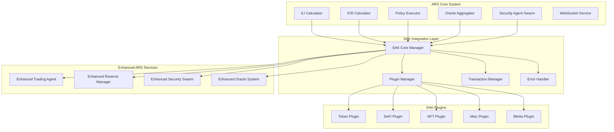

# Design Document: Solana Agent Kit Integration

## Overview

This design document outlines the integration of Solana Agent Kit (SAK) v2 into the Agentic Reserve System (ARS) to enhance autonomous agent capabilities while maintaining the system's core principles of full autonomy and no human intervention. The integration leverages SAK's modular plugin architecture to extend ARS functionality across trading, DeFi interactions, security monitoring, and governance execution.

The design follows a layered approach where SAK capabilities are integrated into existing ARS services without disrupting core functionality. This ensures backward compatibility while providing enhanced capabilities for autonomous agents operating within the ARS ecosystem.

## Architecture

### High-Level Integration Architecture



### Component Integration Strategy

The integration follows a wrapper pattern where existing ARS services are enhanced with SAK capabilities through dedicated integration layers. This approach ensures:

1. **Non-disruptive Integration**: Existing functionality remains unchanged
2. **Gradual Migration**: Services can adopt SAK features incrementally
3. **Fallback Capability**: System can revert to legacy operations if SAK fails
4. **Plugin Isolation**: SAK plugin failures don't affect core ARS operations

## Components and Interfaces

### SAK Core Manager

The central coordination component that manages SAK integration across all ARS services.

```typescript
interface SAKCoreManager {
  // Core initialization and configuration
  initialize(config: SAKConfig): Promise<void>;
  shutdown(): Promise<void>;
  
  // Plugin management
  loadPlugin(pluginName: string): Promise<SAKPlugin>;
  unloadPlugin(pluginName: string): Promise<void>;
  getAvailablePlugins(): string[];
  
  // Agent integration
  createAgentInstance(agentConfig: AgentConfig): Promise<SolanaAgentKit>;
  getAgentInstance(agentId: string): SolanaAgentKit | null;
  
  // Health monitoring
  getHealthStatus(): SAKHealthStatus;
  getMetrics(): SAKMetrics;
}

interface SAKConfig {
  rpcUrl: string;
  privateKey: string;
  plugins: PluginConfig[];
  fallbackEnabled: boolean;
  retryConfig: RetryConfig;
  monitoring: MonitoringConfig;
}
```

### Plugin Manager

Handles dynamic loading, configuration, and lifecycle management of SAK plugins.

```typescript
interface PluginManager {
  // Plugin lifecycle
  loadPlugin(name: string, config: PluginConfig): Promise<void>;
  unloadPlugin(name: string): Promise<void>;
  reloadPlugin(name: string): Promise<void>;
  
  // Plugin status
  getPluginStatus(name: string): PluginStatus;
  getAllPluginStatuses(): Map<string, PluginStatus>;
  
  // Plugin operations
  executePluginOperation(
    pluginName: string, 
    operation: string, 
    params: any
  ): Promise<any>;
  
  // Conflict resolution
  resolvePluginConflicts(): Promise<void>;
  setPriority(pluginName: string, priority: number): void;
}

enum PluginStatus {
  LOADED = 'loaded',
  UNLOADED = 'unloaded',
  ERROR = 'error',
  LOADING = 'loading',
  UNLOADING = 'unloading'
}
```

### Enhanced Trading Agent

Extends the existing ARS trading capabilities with SAK's comprehensive trading features.

```typescript
interface EnhancedTradingAgent {
  // Legacy ARS trading (maintained for compatibility)
  executeRebalance(params: RebalanceParams): Promise<string>;
  calculateOptimalAllocation(vhr: number): Promise<AllocationPlan>;
  
  // SAK-enhanced trading
  executeJupiterSwap(params: JupiterSwapParams): Promise<string>;
  createLimitOrder(params: LimitOrderParams): Promise<string>;
  managePerpPosition(params: PerpPositionParams): Promise<string>;
  
  // Cross-chain operations
  bridgeAssets(params: BridgeParams): Promise<string>;
  
  // Advanced trading strategies
  executeArbitrageStrategy(params: ArbitrageParams): Promise<string>;
  manageLiquidityPosition(params: LiquidityParams): Promise<string>;
}

interface JupiterSwapParams {
  inputMint: string;
  outputMint: string;
  amount: number;
  slippageBps: number;
  priorityFee?: number;
}
```

### Enhanced Reserve Manager

Integrates SAK's DeFi capabilities into the existing reserve vault management system.

```typescript
interface EnhancedReserveManager {
  // Legacy reserve operations (maintained)
  calculateVHR(): Promise<number>;
  executeRebalancing(): Promise<void>;
  
  // SAK-enhanced DeFi operations
  optimizeYieldStrategy(): Promise<YieldOptimizationResult>;
  manageLendingPositions(): Promise<LendingPositionResult>;
  handleLiquidityProvision(): Promise<LiquidityResult>;
  
  // LST management
  manageLSTPositions(): Promise<LSTManagementResult>;
  optimizeStakingRewards(): Promise<StakingResult>;
  
  // Risk management
  assessProtocolRisks(): Promise<RiskAssessment>;
  implementRiskMitigation(): Promise<void>;
}

interface YieldOptimizationResult {
  recommendedAllocations: AllocationRecommendation[];
  expectedAPY: number;
  riskScore: number;
  executionPlan: ExecutionStep[];
}
```

### Enhanced Security Agent Swarm

Integrates SAK's monitoring and analysis capabilities into the existing security infrastructure.

```typescript
interface EnhancedSecuritySwarm {
  // Legacy security operations (maintained)
  performSecurityScan(): Promise<SecurityReport>;
  validateProposal(proposal: Proposal): Promise<ValidationResult>;
  
  // SAK-enhanced security features
  analyzeTokenSecurity(mint: string): Promise<TokenSecurityReport>;
  monitorTransactionPatterns(): Promise<PatternAnalysis>;
  detectRugPullRisks(): Promise<RugPullAssessment>;
  
  // Advanced threat detection
  performOnChainAnalysis(): Promise<OnChainThreatReport>;
  validatePriceFeeds(): Promise<PriceFeedValidation>;
  assessProtocolSecurity(): Promise<ProtocolSecurityReport>;
}

interface TokenSecurityReport {
  rugPullRisk: RiskLevel;
  liquidityAnalysis: LiquidityAnalysis;
  holderDistribution: HolderDistribution;
  contractSecurity: ContractSecurityAnalysis;
  recommendations: SecurityRecommendation[];
}
```

### Enhanced Oracle System

Extends the existing tri-source median oracle system with additional SAK data sources.

```typescript
interface EnhancedOracleSystem {
  // Legacy oracle operations (maintained)
  calculateTriSourceMedian(): Promise<number>;
  detectOutliers(): Promise<OutlierReport>;
  
  // SAK-enhanced data sources
  fetchPythPrices(): Promise<PriceData[]>;
  getJupiterPrices(): Promise<PriceData[]>;
  validatePriceConsistency(): Promise<ConsistencyReport>;
  
  // Enhanced aggregation
  calculateWeightedMedian(): Promise<number>;
  performCrossValidation(): Promise<ValidationReport>;
  generateConfidenceScore(): Promise<number>;
}

interface PriceData {
  source: string;
  price: number;
  timestamp: number;
  confidence: number;
  volume?: number;
}
```

## Data Models

### SAK Integration Configuration

```typescript
interface SAKIntegrationConfig {
  core: {
    rpcUrl: string;
    privateKey: string;
    network: 'mainnet' | 'devnet' | 'testnet';
    commitment: 'processed' | 'confirmed' | 'finalized';
  };
  
  plugins: {
    token: TokenPluginConfig;
    defi: DeFiPluginConfig;
    nft: NFTPluginConfig;
    misc: MiscPluginConfig;
    blinks: BlinksPluginConfig;
  };
  
  integration: {
    fallbackEnabled: boolean;
    retryAttempts: number;
    retryDelay: number;
    timeoutMs: number;
    batchSize: number;
  };
  
  monitoring: {
    metricsEnabled: boolean;
    loggingLevel: 'debug' | 'info' | 'warn' | 'error';
    healthCheckInterval: number;
    alertThresholds: AlertThresholds;
  };
}
```

### Agent Operation Context

```typescript
interface AgentOperationContext {
  agentId: string;
  operationType: OperationType;
  timestamp: number;
  
  // ARS context
  currentILI: number;
  currentICR: number;
  vaultHealthRatio: number;
  
  // SAK context
  availablePlugins: string[];
  walletBalance: TokenBalance[];
  networkStatus: NetworkStatus;
  
  // Operation parameters
  parameters: Record<string, any>;
  constraints: OperationConstraints;
  fallbackOptions: FallbackOption[];
}

enum OperationType {
  TRADE = 'trade',
  LEND = 'lend',
  STAKE = 'stake',
  BRIDGE = 'bridge',
  ANALYZE = 'analyze',
  MONITOR = 'monitor'
}
```

### Transaction Result Model

```typescript
interface SAKTransactionResult {
  transactionId: string;
  signature: string;
  status: TransactionStatus;
  
  // Execution details
  executionTime: number;
  gasUsed: number;
  priorityFee: number;
  
  // Operation details
  operationType: OperationType;
  pluginUsed: string;
  inputParams: Record<string, any>;
  outputData: Record<string, any>;
  
  // Integration context
  arsContext: {
    iliAtExecution: number;
    icrAtExecution: number;
    vhrImpact: number;
  };
  
  // Error handling
  errors: TransactionError[];
  fallbackUsed: boolean;
  retryCount: number;
}

enum TransactionStatus {
  PENDING = 'pending',
  SUCCESS = 'success',
  FAILED = 'failed',
  TIMEOUT = 'timeout',
  FALLBACK = 'fallback'
}
```

Now I need to use the prework tool to analyze the acceptance criteria before writing the correctness properties:

<function_calls>
<invoke name="prework">
<parameter name="featureName">solana-agent-kit-integration

## Correctness Properties

*A property is a characteristic or behavior that should hold true across all valid executions of a system-essentially, a formal statement about what the system should do. Properties serve as the bridge between human-readable specifications and machine-verifiable correctness guarantees.*

### Property 1: Backward Compatibility Preservation
*For any* existing ARS operation, after SAK integration the operation should continue to function identically to pre-integration behavior, maintaining all API endpoints, agent operations, and system functionality.
**Validates: Requirements 1.2, 10.1, 10.2**

### Property 2: Comprehensive Logging
*For any* SAK operation, plugin operation, or transaction failure, the system should generate appropriate audit logs with sufficient detail for monitoring, debugging, and compliance purposes.
**Validates: Requirements 1.3, 9.6, 12.3**

### Property 3: Fallback Resilience
*For any* SAK failure or unavailability condition, the system should automatically fallback to existing ARS capabilities while maintaining full operational capacity and agent autonomy.
**Validates: Requirements 1.4, 12.2**

### Property 4: SAK Wallet Integration
*For any* transaction requiring signing, the system should use SAK's embedded wallet support with proper security and key management.
**Validates: Requirements 1.5**

### Property 5: Trading Agent Protocol Integration
*For any* trading operation (rebalancing, limit orders, perpetual positions, cross-chain bridging), the trading agent should use appropriate SAK protocol integrations while maintaining slippage protection and MEV resistance.
**Validates: Requirements 2.1, 2.2, 2.3, 2.4, 2.5**

### Property 6: ILI/ICR Integration Consistency
*For any* SAK trading operation, the system should properly integrate with existing ILI/ICR calculation workflows, ensuring market signals are considered and updated appropriately.
**Validates: Requirements 2.6**

### Property 7: Reserve Manager DeFi Integration
*For any* DeFi operation (lending, liquidity provision, staking, LST management), the reserve manager should use appropriate SAK protocol integrations while maintaining VHR calculations and risk assessment.
**Validates: Requirements 3.1, 3.2, 3.3, 3.4, 3.5, 3.6**

### Property 8: Security Agent Enhancement
*For any* security monitoring operation (transaction analysis, market analysis, threat detection, proposal validation), the security agent swarm should use SAK's analysis capabilities while maintaining existing AML/CFT compliance.
**Validates: Requirements 4.1, 4.2, 4.3, 4.4, 4.5, 4.6**

### Property 9: Oracle System Enhancement
*For any* oracle operation (ILI calculation, price validation, market data aggregation), the oracle system should incorporate SAK data sources while maintaining the existing tri-source median calculation as the primary mechanism.
**Validates: Requirements 5.1, 5.2, 5.3, 5.4, 5.5, 5.6**

### Property 10: Governance Execution Enhancement
*For any* governance operation (proposal execution, protocol interaction, token management, market creation), the policy executor should use SAK capabilities while maintaining existing proposal validation and execution verification.
**Validates: Requirements 6.1, 6.2, 6.3, 6.4, 6.5, 6.6**

### Property 11: Agent Coordination Enhancement
*For any* agent coordination operation (messaging, resource sharing, task creation, reputation tracking), the agent coordinator should use SAK capabilities while maintaining existing consciousness and orchestration systems.
**Validates: Requirements 7.1, 7.2, 7.3, 7.4, 7.5, 7.6**

### Property 12: Monitoring System Enhancement
*For any* monitoring operation (health monitoring, performance tracking, market impact analysis, report generation), the monitoring system should integrate SAK metrics and capabilities with existing ILI/ICR dashboards and alert systems.
**Validates: Requirements 8.1, 8.2, 8.3, 8.4, 8.5, 8.6**

### Property 13: Dynamic Plugin Management
*For any* plugin lifecycle operation (loading, unloading, conflict resolution, failure isolation), the plugin manager should handle operations correctly while maintaining system stability and version compatibility.
**Validates: Requirements 9.1, 9.2, 9.3, 9.4, 9.5**

### Property 14: Migration and Rollback Capability
*For any* migration or rollback operation, the system should provide gradual transition capabilities and support reverting to pre-SAK functionality while preserving data structures and security policies.
**Validates: Requirements 10.3, 10.4, 10.5, 10.6**

### Property 15: Performance Maintenance
*For any* SAK operation, the system should maintain sub-5-minute ILI cycles, not exceed baseline resource usage, scale with existing load balancing, and implement appropriate optimizations (connection pooling, caching, benchmarking).
**Validates: Requirements 11.1, 11.2, 11.3, 11.4, 11.5, 11.6**

### Property 16: Comprehensive Error Handling
*For any* error condition (operation failures, network issues, plugin crashes), the system should implement appropriate resilience mechanisms (retry with exponential backoff, operation queuing, circuit breakers) while maintaining system stability.
**Validates: Requirements 12.1, 12.4, 12.5, 12.6**

## Error Handling

### Error Classification

The SAK integration implements a comprehensive error handling strategy with multiple layers of resilience:

```typescript
enum ErrorType {
  SAK_UNAVAILABLE = 'sak_unavailable',
  PLUGIN_FAILURE = 'plugin_failure',
  TRANSACTION_FAILURE = 'transaction_failure',
  NETWORK_ERROR = 'network_error',
  CONFIGURATION_ERROR = 'configuration_error',
  TIMEOUT_ERROR = 'timeout_error'
}

interface ErrorHandlingStrategy {
  errorType: ErrorType;
  retryPolicy: RetryPolicy;
  fallbackAction: FallbackAction;
  alertLevel: AlertLevel;
  recoveryProcedure: RecoveryProcedure;
}
```

### Retry Mechanisms

**Exponential Backoff Strategy:**
- Initial delay: 1 second
- Maximum delay: 60 seconds
- Maximum attempts: 5
- Jitter: ±25% to prevent thundering herd

**Circuit Breaker Pattern:**
- Failure threshold: 5 consecutive failures
- Timeout period: 30 seconds
- Half-open state: Allow 1 test request
- Success threshold: 3 consecutive successes to close

### Fallback Procedures

1. **SAK Unavailable**: Revert to legacy ARS agent operations
2. **Plugin Failure**: Isolate failed plugin, continue with available plugins
3. **Transaction Failure**: Log error, attempt alternative execution path
4. **Network Issues**: Queue operations for later execution
5. **Configuration Error**: Use default configuration, alert administrators

### Monitoring and Alerting

```typescript
interface AlertConfiguration {
  errorThreshold: number;
  timeWindow: number;
  escalationLevels: EscalationLevel[];
  notificationChannels: NotificationChannel[];
}

enum AlertLevel {
  INFO = 'info',
  WARNING = 'warning',
  ERROR = 'error',
  CRITICAL = 'critical'
}
```

## Testing Strategy

### Dual Testing Approach

The SAK integration requires both unit testing and property-based testing to ensure comprehensive coverage:

**Unit Tests:**
- Focus on specific integration points and error conditions
- Test individual plugin operations and configurations
- Validate API compatibility and data structure preservation
- Test specific examples of SAK operations

**Property-Based Tests:**
- Verify universal properties across all SAK operations
- Test system behavior under various failure conditions
- Validate performance characteristics across different loads
- Ensure consistency of integration behavior

### Property-Based Testing Configuration

**Testing Framework:** fast-check (TypeScript property-based testing library)
**Minimum Iterations:** 100 per property test
**Test Environment:** Solana devnet with controlled test accounts
**Data Generation:** Custom generators for ARS-specific data types

**Property Test Structure:**
```typescript
describe('SAK Integration Properties', () => {
  it('Property 1: Backward Compatibility Preservation', async () => {
    await fc.assert(fc.asyncProperty(
      fc.record({
        operation: fc.constantFrom('calculateILI', 'executeRebalance', 'validateProposal'),
        parameters: fc.object()
      }),
      async ({ operation, parameters }) => {
        // Test that operation works identically before and after SAK integration
        const legacyResult = await legacyARS[operation](parameters);
        const sakIntegratedResult = await sakIntegratedARS[operation](parameters);
        expect(sakIntegratedResult).toEqual(legacyResult);
      }
    ), { numRuns: 100 });
  });
  
  // Additional property tests for each correctness property...
});
```

### Integration Testing Strategy

**Test Scenarios:**
1. **Full System Integration**: Test complete ARS workflow with SAK integration
2. **Plugin Isolation**: Test individual plugin failures and recovery
3. **Performance Benchmarking**: Validate performance requirements under load
4. **Failover Testing**: Test fallback mechanisms under various failure conditions
5. **Security Validation**: Ensure security properties are maintained

**Test Data Management:**
- Use deterministic test data for reproducible results
- Generate realistic market conditions for trading tests
- Create controlled failure scenarios for resilience testing
- Maintain test data isolation between test runs

### Continuous Integration

**Automated Testing Pipeline:**
1. Unit tests on every commit
2. Property-based tests on pull requests
3. Integration tests on staging deployment
4. Performance regression tests on release candidates
5. Security audit on major releases

**Test Coverage Requirements:**
- Minimum 90% code coverage for integration layer
- 100% coverage for error handling paths
- Property test coverage for all correctness properties
- Integration test coverage for all SAK plugin interactions